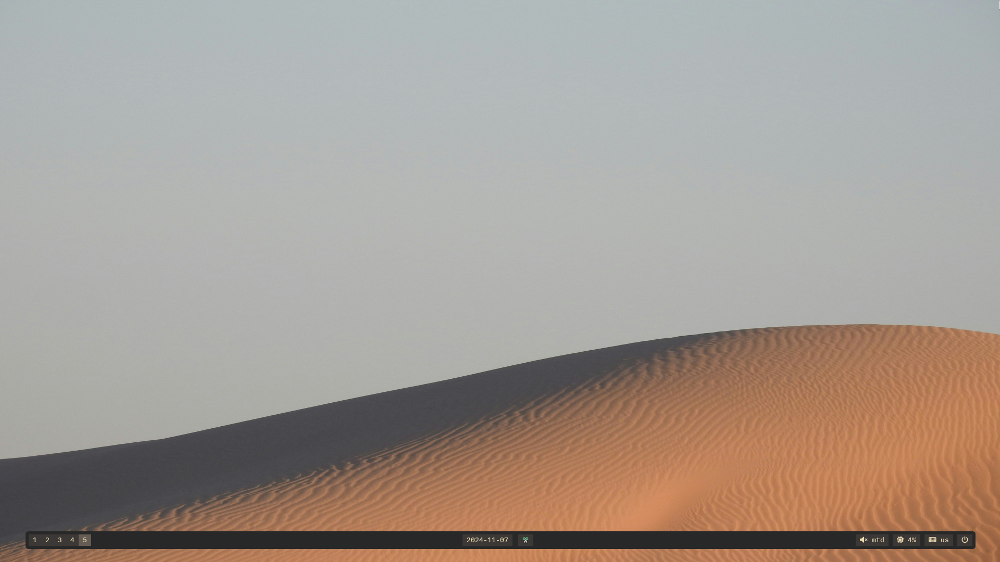
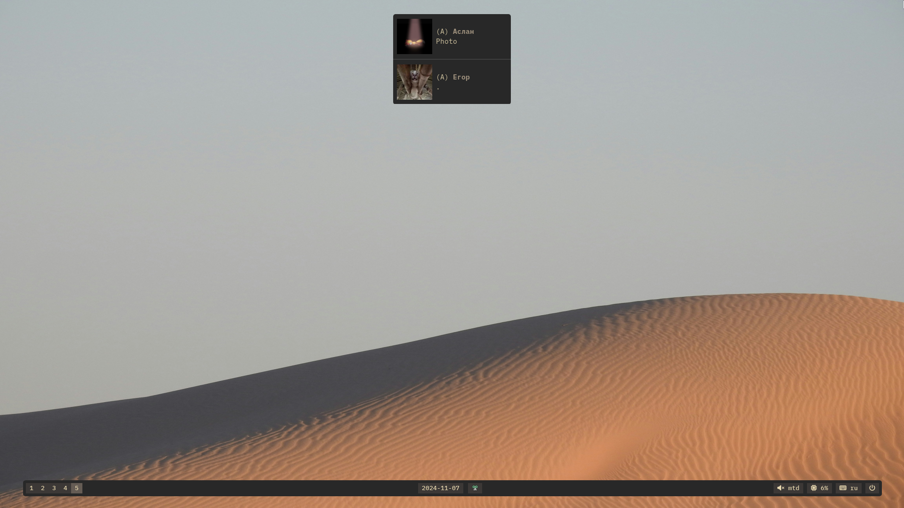
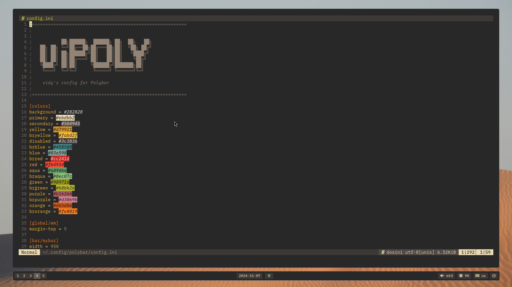
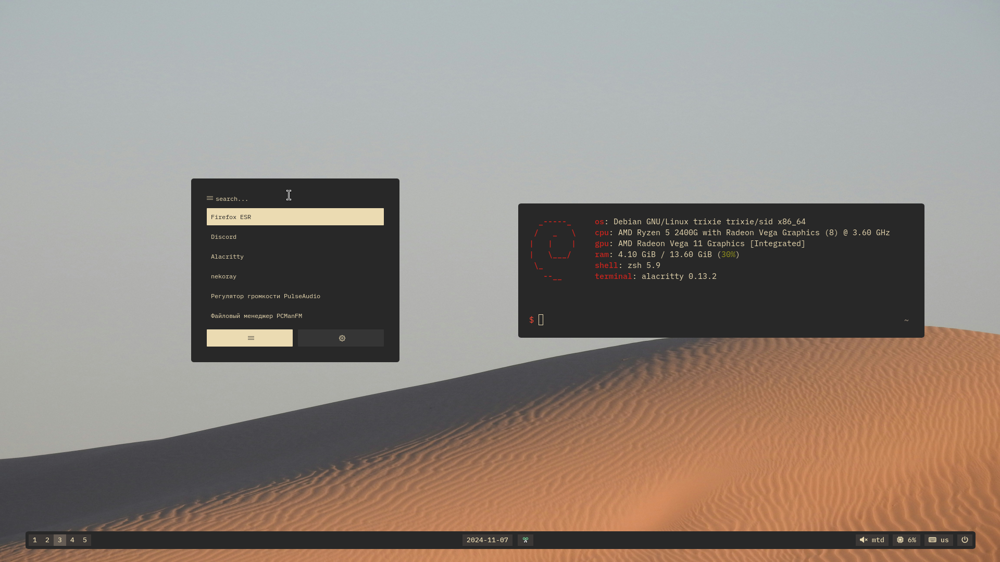
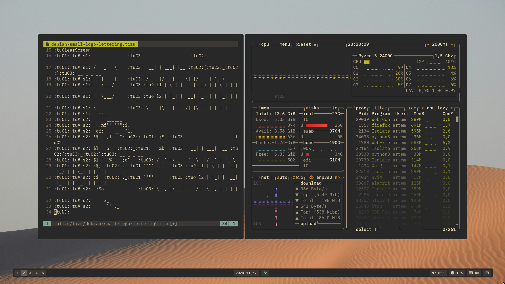

## My rice!
# Preview!

video preview is coming soon
# Info!
this wallpaper was found  in the "irl" section
programs i use here are:
* polybar
* alacritty ft. neovim and fastfetch
* rofi
* btop
* dunst
* firefox with textfox theme (files included)
* obsidian
* gimp (the image opened in there is my gruvbox-colored variation of ) 
* picom (rounded corners)
# Credits!
* rofi config is an edited version of 
* tizu file opened in neovim on the 5th screenshot is my own ascii art for 
