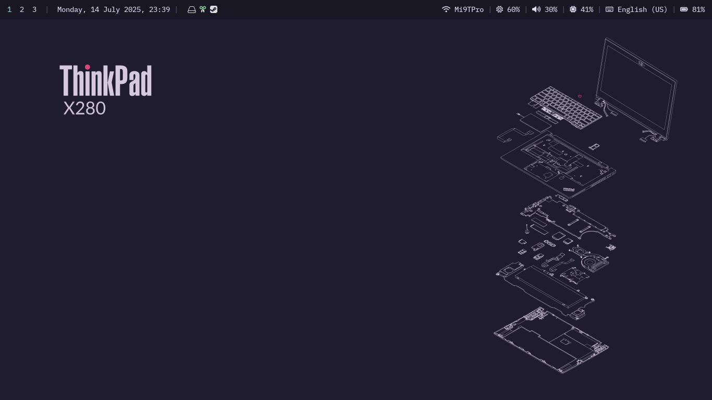
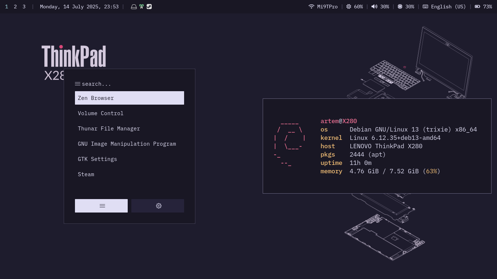
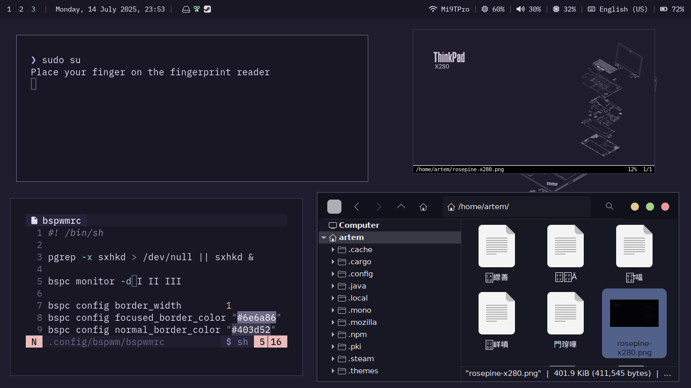
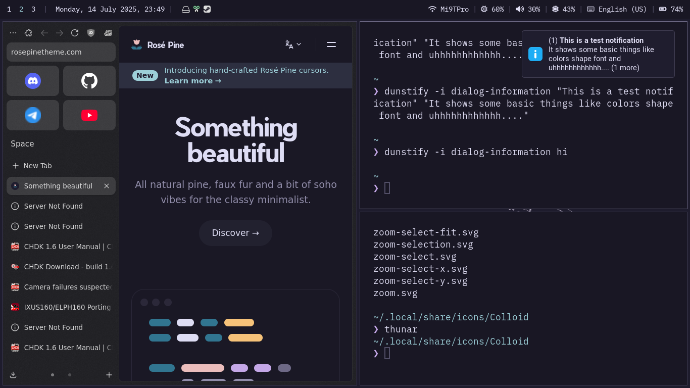

### 
\* vidy007's dotfiles \* 

 
#### screenshots:

#### wallpaper:

#### programs shown here
* polybar
* alacritty ft. neovim and fastfetch
* rofi
* dunst
* zen
#### credit
* rofi config is an edited version of 
